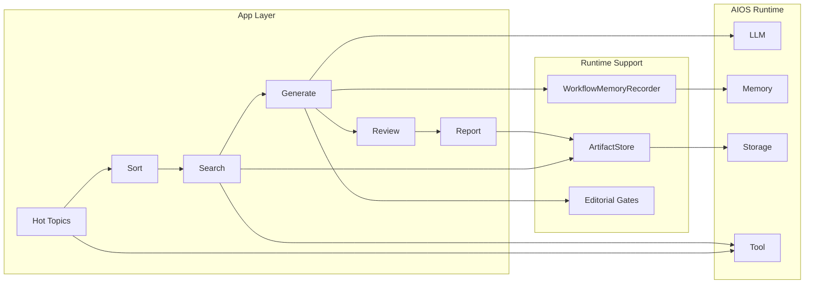

# AIOS-NP

AIOS-NP 是一个基于 **AIOS runtime** 改造出来的在线新闻 Agent 系统。项目最早来自竞赛型多智能体流水线，当前已经重构成一套更明确的应用架构：

- `apps/news_app` 负责编排新闻 workflow
- `aios/` 提供 kernel 级 runtime 能力
- `cerebrum/` 提供 `llm / memory / storage / tool` 四类 SDK API
- `runtime_support/` 将 AIOS 能力包装成业务层可直接使用的组件
- `ecosystem + service` 负责调度、状态持久化、Dashboard 与 API 暴露

如果你第一次进入这个仓库，最重要的一句理解是：

> 这不是“几个 Agent 拼起来的 demo”，而是一套以 AIOS 为底座、以新闻日报为业务场景的在线 Agent 应用。

## 当前架构

当前项目可以粗略分成三层：

1. **底座层**
   - `aios/`
   - `cerebrum/`
2. **业务应用层**
   - `apps/news_app/`
   - `runtime_support/`
3. **执行能力层**
   - `agents/`

主业务入口已经收敛到：

- [run_news_app.py](./run_news_app.py)
- [apps/news_app/cli.py](./apps/news_app/cli.py)
- [apps/news_app/pipeline.py](./apps/news_app/pipeline.py)

## 系统总览



## 六阶段工作流

当前新闻工作流由 `config.json` 定义，主顺序是：

```json
["hot_api", "sort", "search", "generate", "review", "report"]
```

各阶段含义如下：

1. `hot_api`：抓取多平台热榜
2. `sort`：做分类、整理与热点分发
3. `search`：为 topic 补充搜索证据和图片候选
4. `generate`：生成标题、摘要、正文，并经过 generation gate
5. `review`：执行审阅、优化与事实核查
6. `report`：汇总为最终日报，输出 `txt / json / html`

## 成品日报截图

下面这张图直接来自当前成品日报
[`output/新闻报_20260422_102214.html`](./output/新闻报_20260422_102214.html)
的真实截图：


## 快速开始

### 1. 准备本地环境

```bash
cd /path/to/AIOS-NP
bash ./scripts/setup_local_env.sh
```

脚本会优先尝试创建 `.venv`，如果系统 Python 3.10 不满足条件，则回退到 `.conda-env`。

### 2. 配置环境变量

先复制一份示例：

```bash
cp .env.local.example .env.local
```

最少需要检查这些配置：

- `ZH_API_KEY`
- `TAVILY_API_KEY`
- `OPENAI_API_KEY`
- `AIOS_LLM_MODEL`
- `AIOS_LLM_BASE_URL`

当前默认使用 OpenAI 兼容接口。

### 3. 启动 AIOS kernel（推荐）

```bash
bash ./scripts/start_local_kernel.sh
```

默认地址：

- `http://localhost:8001`

### 4. 运行一次新闻工作流

先选本地 Python：

```bash
PYTHON_BIN=./.venv/bin/python
[ -x "$PYTHON_BIN" ] || PYTHON_BIN=./.conda-env/bin/python
```

并行模式：

```bash
"$PYTHON_BIN" run_news_app.py --mode parallel
```

串行模式：

```bash
"$PYTHON_BIN" run_news_app.py --mode serial
```

也可以显式传入密钥：

```bash
"$PYTHON_BIN" run_news_app.py \
  --mode parallel \
  --zh-api-key "$ZH_API_KEY" \
  --tavily-api-key "$TAVILY_API_KEY"
```

### 5. 启动在线服务

```bash
bash ./scripts/start_news_ecosystem.sh
```

默认地址：

- `http://localhost:8010`

常用入口：

- `/health`
- `/dashboard`
- `/api/ecosystem/status`
- `/api/ecosystem/runs`
- `/api/ecosystem/reports/latest/html`

## 输出与运行数据

默认情况下：

- 中间产物写到 `intermediate/`
- 最终日报写到 `output/`
- 在线运行状态写到 `ecosystem/`

其中：

- `output/` 保留历史日报文件
- API 和前端默认消费 latest 视图

## 仓库结构

```text
AIOS-NP/
├── aios/                  AIOS kernel 与 scheduler / syscall / manager
├── cerebrum/              SDK / Query / Response API 层
├── apps/news_app/         新闻业务应用层
├── agents/                热榜、分类、搜索、生成、审阅、成报等能力
├── runtime_support/       ArtifactStore / WorkflowMemoryRecorder
├── scripts/               本地环境、启动、自检脚本
├── tests/                 当前正式测试
├── run_news_app.py        推荐 CLI 入口
├── config.json            workflow 配置
└── 项目介绍.md             深度项目档案
```

## 当前项目的几个重点

- 主编排器是 `NewsWorkflowApp`，不再依赖比赛时期的 AutoGen 对话式组织
- `hot_api` 和 `web_search` 已开始下沉为 AIOS tool runtime 调用
- 规则层通过 `editorial.py` 提供 generation gate / publishability gate
- workflow memory 记录的是“编辑决策经验”，不是普通聊天上下文
- artifact store 支持 AIOS storage 与本地 fallback 双路径

## 推荐阅读顺序

如果你准备系统理解这个项目，建议按下面顺序读：

1. [项目介绍.md](./项目介绍.md)
2. [apps/news_app/pipeline.py](./apps/news_app/pipeline.py)
3. [apps/news_app/editorial.py](./apps/news_app/editorial.py)
4. [runtime_support/artifacts.py](./runtime_support/artifacts.py)
5. [runtime_support/memory.py](./runtime_support/memory.py)
6. [apps/news_app/ecosystem.py](./apps/news_app/ecosystem.py)
7. [apps/news_app/service.py](./apps/news_app/service.py)

## 自检

本地修改后，建议至少跑这两步：

```bash
"$PYTHON_BIN" -m unittest discover -s tests -q
"$PYTHON_BIN" scripts/news_app_doctor.py
```

## 补充说明

- `parallel_pipeline.py` 和 `serial_pipeline.py` 目前主要保留为兼容入口，不再是推荐主线
- `.gitignore` 已排除 `intermediate/`、`output/`、`logs/` 等运行产物
- 深度技术说明与项目档案请看 [项目介绍.md](./项目介绍.md)
