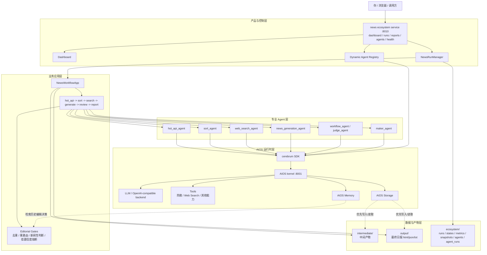
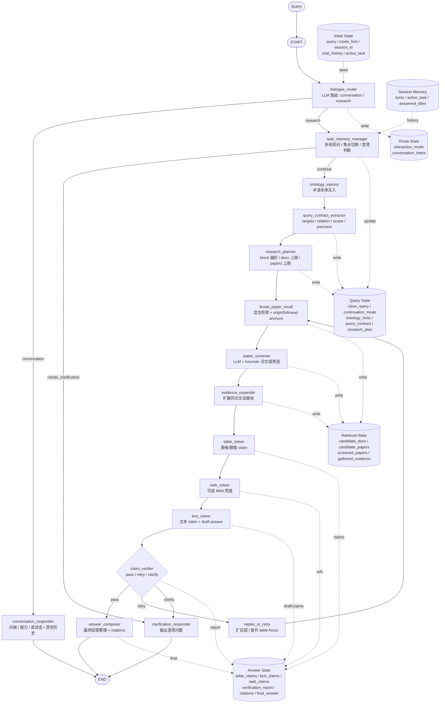
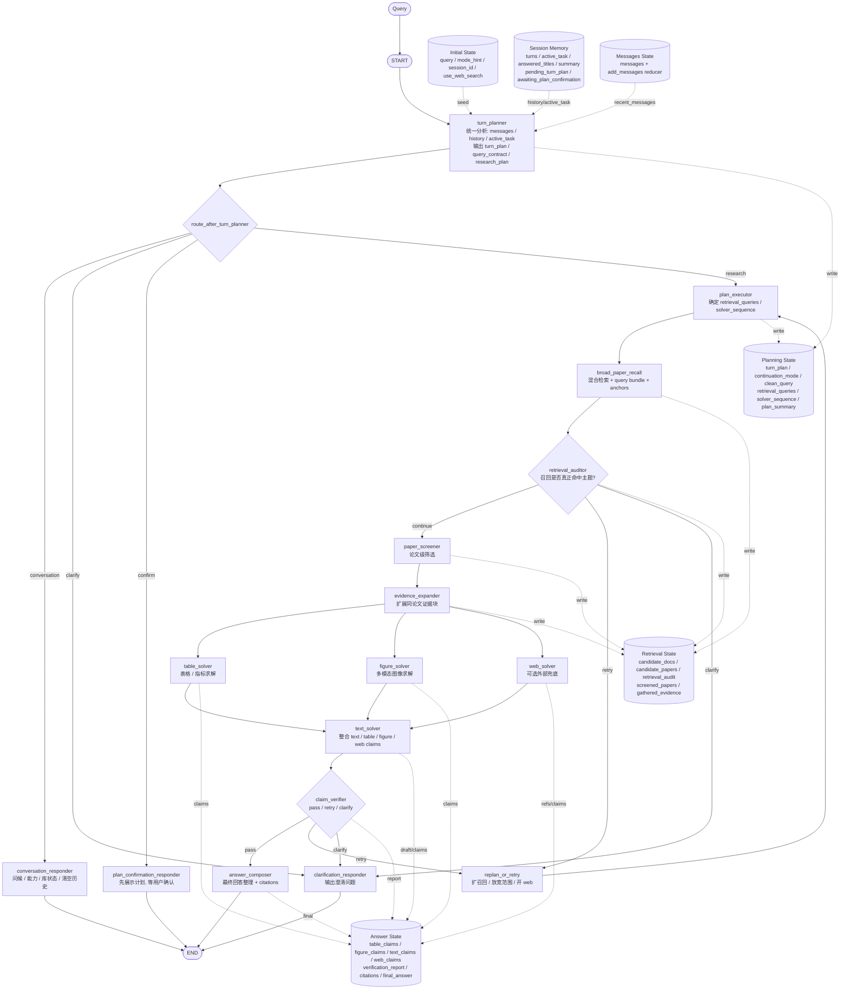

```mermaid
graph TB
    User[你 / 浏览器 / 调用方]

    subgraph Product["产品与控制层"]
        Service["news ecosystem service :8010<br/>dashboard / runs / reports / agents / health"]
        Dashboard["Dashboard"]
        Registry["Dynamic Agent Registry"]
        RunMgr["NewsRunManager"]
    end

    subgraph App["业务应用层"]
        Workflow["NewsWorkflowApp"]
        Pipeline["hot_api -> sort -> search -> generate -> review -> report"]
        Editorial["Editorial Gates<br/>去重 / 重路由 / 新闻性判断 / 低置信度熔断"]
    end

    subgraph Agents["专业 Agent 层"]
        Hot["hot_api_agent"]
        Sort["sort_agent"]
        Search["web_search_agent"]
        Gen["news_generation_agent"]
        Review["workflow_agent / judge_agent"]
        Maker["maker_agent"]
    end

    subgraph Runtime["AIOS 运行时层"]
        Cerebrum["cerebrum SDK"]
        Kernel["AIOS kernel :8001"]
        LLM["LLM / OpenAI-compatible backend"]
        Tools["Tools<br/>热搜 / Web Search / 其他能力"]
        Storage["AIOS Storage"]
        Memory["AIOS Memory"]
    end

    subgraph Data["数据与产物层"]
        Intermediate["intermediate/<br/>中间产物"]
        Output["output/<br/>最终日报 html/json/txt"]
        Ecosystem["ecosystem/<br/>runs / states / metrics / snapshots / agents / agent_runs"]
    end

    User --> Service
    Service --> Dashboard
    Service --> Registry
    Service --> RunMgr
    RunMgr --> Workflow
    Workflow --> Pipeline
    Pipeline --> Editorial
    Pipeline --> Hot
    Pipeline --> Sort
    Pipeline --> Search
    Pipeline --> Gen
    Pipeline --> Review
    Pipeline --> Maker

    Hot --> Cerebrum
    Sort --> Cerebrum
    Search --> Cerebrum
    Gen --> Cerebrum
    Review --> Cerebrum
    Maker --> Cerebrum
    Registry --> Cerebrum

    Cerebrum --> Kernel
    Kernel --> LLM
    Kernel --> Tools
    Kernel --> Storage
    Kernel --> Memory

    Workflow --> Intermediate
    Workflow --> Output
    RunMgr --> Ecosystem
    Storage -.优先写入/读取.-> Intermediate
    Storage -.优先写入/读取.-> Output
    Memory -.检索历史编辑决策.-> Editorial
```

```mermaid
flowchart TD
    Q([Query]) --> START([START])

    START --> Router["dialogue_router<br/>LLM 路由: conversation / research"]

    Router -->|conversation| Conv["conversation_responder<br/>问候 / 能力 / 库状态 / 清空历史"]
    Conv --> END([END])

    Router -->|research| Memory["task_memory_manager<br/>多轮续问 / 焦点切换 / 澄清判断"]
    Memory -->|needs_clarification| Clarify["clarification_responder<br/>输出澄清问题"]
    Clarify --> END

    Memory -->|continue| Ontology["ontology_injector<br/>术语本体注入"]
    Ontology --> Contract["query_contract_extractor<br/>targets / relation / scope / precision"]
    Contract --> Plan["research_planner<br/>block 偏好 / docs 上限 / papers 上限"]
    Plan --> Recall["broad_paper_recall<br/>混合检索 + origin/followup anchors"]
    Recall --> Screen["paper_screener<br/>LLM + heuristic 论文级筛选"]
    Screen --> Evidence["evidence_expander<br/>扩展同论文证据块"]
    Evidence --> Table["table_solver<br/>表格/数值 claim"]
    Table --> Web["web_solver<br/>可选 Web 兜底"]
    Web --> Text["text_solver<br/>文本 claim + draft answer"]
    Text --> Verify{"claim_verifier<br/>pass / retry / clarify"}

    Verify -->|pass| Compose["answer_composer<br/>最终回答整理 + citations"]
    Compose --> END

    Verify -->|retry| Retry["replan_or_retry<br/>扩召回 / 提升 table focus"]
    Retry --> Recall

    Verify -->|clarify| Clarify

    Init[(Initial State<br/>query / mode_hint / session_id<br/>chat_history / active_task)]
    Session[(Session Memory<br/>turns / active_task / answered_titles)]
    RouteState[(Route State<br/>interaction_mode<br/>conversation_intent)]
    QueryState[(Query State<br/>clean_query / continuation_mode<br/>ontology_hints / query_contract / research_plan)]
    RetrievalState[(Retrieval State<br/>candidate_docs / candidate_papers<br/>screened_papers / gathered_evidence)]
    AnswerState[(Answer State<br/>table_claims / text_claims / web_claims<br/>verification_report / citations / final_answer)]

    Init -. seed .-> Router
    Session -. history .-> Memory
    Router -. write .-> RouteState
    Memory -. update .-> QueryState
    Contract -. write .-> QueryState
    Plan -. write .-> QueryState
    Recall -. write .-> RetrievalState
    Screen -. write .-> RetrievalState
    Evidence -. write .-> RetrievalState
    Table -. claims .-> AnswerState
    Web -. refs .-> AnswerState
    Text -. draft/claims .-> AnswerState
    Verify -. report .-> AnswerState
    Compose -. final .-> AnswerState

```

```mermaid
flowchart TD
    Q([Query]) --> START([START])

    START --> Planner["turn_planner<br/>统一分析: messages / history / active_task<br/>输出 turn_plan / query_contract / research_plan"]

    Planner --> Route{route_after_turn_planner}

    Route -->|conversation| Conv["conversation_responder<br/>问候 / 能力 / 库状态 / 清空历史"]
    Conv --> END([END])

    Route -->|clarify| Clarify["clarification_responder<br/>输出澄清问题"]
    Clarify --> END

    Route -->|confirm| PlanConfirm["plan_confirmation_responder<br/>先展示计划, 等用户确认"]
    PlanConfirm --> END

    Route -->|research| PlanExec["plan_executor<br/>确定 retrieval_queries / solver_sequence"]

    PlanExec --> Recall["broad_paper_recall<br/>混合检索 + query bundle + anchors"]
    Recall --> Audit{"retrieval_auditor<br/>召回是否真正命中主题?"}

    Audit -->|continue| Screen["paper_screener<br/>论文级筛选"]
    Audit -->|retry| Retry["replan_or_retry<br/>扩召回 / 放宽范围 / 开 web"]
    Audit -->|clarify| Clarify

    Screen --> Evidence["evidence_expander<br/>扩展同论文证据块"]

    Evidence --> Table["table_solver<br/>表格 / 指标求解"]
    Evidence --> Figure["figure_solver<br/>多模态图像求解"]
    Evidence --> Web["web_solver<br/>可选外部兜底"]

    Table --> Text["text_solver<br/>整合 text / table / figure / web claims"]
    Figure --> Text
    Web --> Text

    Text --> Verify{"claim_verifier<br/>pass / retry / clarify"}

    Verify -->|pass| Compose["answer_composer<br/>最终回答整理 + citations"]
    Compose --> END

    Verify -->|retry| Retry
    Verify -->|clarify| Clarify

    Retry --> PlanExec

    Init[(Initial State<br/>query / mode_hint / session_id / use_web_search)]
    Session[(Session Memory<br/>turns / active_task / answered_titles / summary<br/>pending_turn_plan / awaiting_plan_confirmation)]
    Msg[(Messages State<br/>messages + add_messages reducer)]
    PlanState[(Planning State<br/>turn_plan / continuation_mode / clean_query<br/>retrieval_queries / solver_sequence / plan_summary)]
    RetrievalState[(Retrieval State<br/>candidate_docs / candidate_papers / retrieval_audit<br/>screened_papers / gathered_evidence)]
    AnswerState[(Answer State<br/>table_claims / figure_claims / text_claims / web_claims<br/>verification_report / citations / final_answer)]

    Init -. seed .-> Planner
    Session -. history/active_task .-> Planner
    Msg -. recent_messages .-> Planner

    Planner -. write .-> PlanState
    PlanExec -. write .-> PlanState

    Recall -. write .-> RetrievalState
    Audit -. write .-> RetrievalState
    Screen -. write .-> RetrievalState
    Evidence -. write .-> RetrievalState

    Table -. claims .-> AnswerState
    Figure -. claims .-> AnswerState
    Web -. refs/claims .-> AnswerState
    Text -. draft/claims .-> AnswerState
    Verify -. report .-> AnswerState
    Compose -. final .-> AnswerState

```
