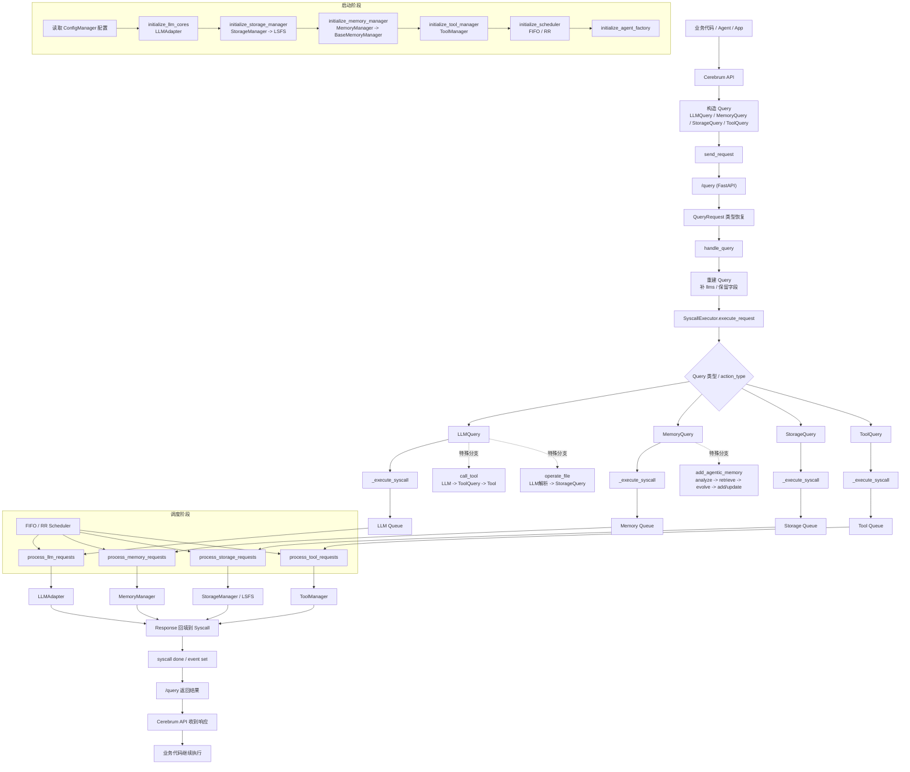

# 背景
## 项目由来

AIOS-NP 是由比赛项目更改而来，发布在线上的项目，并已经公开了MCP。该项目初版获 **第二届中国研究生操作系统开源创新大赛** 国家三等奖。总体而言，是一个基于 workflow 的多 Agent 新闻生成流水线，当前已经演化为 `hot_api -> sort -> search -> generate -> review -> report` 六阶段结构。


## AIOS背景

以下来自于比赛使其调研的笔记修改：

### (1) 必要性

往往需要在同一个设备上运行很多的Agent. ( 即使是Single-Agent也可能在内部分出许多Sub-Agent). 那么底层的LLM就可能要满足很多Agent同时的请求, 如果不做管理, 如果同一个Agent一直密集向LLM发送请求, 那么就会让其他Agent拿不到资源, 看上去像死机一样. 

这个过程实际上很容易让人联想到操作系统的功能 -- 它不仅提供硬件接口对软件的接口, 同时也会按照设计的算法来调度进程, 保证多进程系统依然可以异步有效工作. 

于是类似于传统OS, 一个**基于开源大模型Agent的操作系统, AIOS** 就诞生了.

### (2) 对比传统OS


AIOS的核心是一个或几个大模型, 中间层设计了AIOS的SDK, 来帮助Agent Developer更好构建他们的Agents, 而上层则是会跑各种Agent的应用 ( **AAPs, Agent Applications** ).

以下两张图片分别是传统OS的架构和AIOS架构的示意图.


我们可以发现, AIOS可以很容易类比到传统OS的生态, 由此我们可以体会到AIOS的设计哲学, 如下表: 


两者的发展历程也具有相似性, 只不过AIOS的发展要比OS发展的迅速非常多, 如下图


# AIOS架构

## 1. 总览

**AIOS: AI Agent Operating System** [Github](https://github.com/agiresearch/AIOS/tree/main)[论文](https://arxiv.org/abs/2403.16971), 它将大型语言模型 （LLM） 嵌入到作系统中，并促进基于 LLM 的 AI 代理的开发和部署. AIOS 旨在解决基于 LLM 的代理开发和部署过程中的问题（例如，调度、上下文切换、内存管理、存储管理、工具管理、代理 SDK 管理等）, 为代理开发人员和代理用户提供更好的 AIOS-Agent 生态系统. AIOS 包括 AIOS 内核（此AIOS存储库）和 AIOS SDK（**Cerebrum** 存储库), AIOS 支持 Web UI 和终端 UI. 它的具体框架如下文所展示. 


## 2. Cerebrum

**Cerebrum: Agent SDK for AIOS** [Github](https://github.com/agiresearch/Cerebrum) 专为代理用户和开发人员设计, 使他们能够通过与 AIOS 内核交互来构建和运行代理应用程序. 但要注意, 我当前项目中的 `cerebrum/` 并不是上游 Cerebrum 仓库的完整拷贝, 而是一个**嵌入到 AIOS-NP 中、经过裁剪和本地化适配后的 SDK 子集**. 因此这里不再照抄上游完整目录树, 而是按**当前仓库真实结构**来理解:

```
AIOS-NP/cerebrum
|-- __init__.py
|-- commands
|   |-- download_agent.py
|   |-- download_tool.py
|   |-- list_agenthub_agents.py
|   |-- list_available_llms.py
|   |-- list_local_agents.py
|   |-- list_local_tools.py
|   |-- list_toolhub_tools.py
|   |-- run_agent.py
|   |-- upload_agent.py
|   `-- upload_tool.py
|-- community
|   `-- adapter
|       |-- adapter.py
|       |-- autogen_adapter.py
|       |-- interpreter_adapter.py
|       `-- metagpt_adapter.py
|-- config
|   |-- config.yaml
|   `-- config_manager.py
|-- interface
|   `-- __init__.py
|-- llm
|   |-- apis.py
|   `-- layer.py
|-- manager
|   |-- agent.py
|   |-- package.py
|   `-- tool.py
|-- memory
|   |-- __init__.py
|   |-- apis.py
|   `-- layer.py
|-- storage
|   |-- apis.py
|   `-- layer.py
|-- tool
|   |-- apis.py
|   |-- base.py
|   |-- core
|   `-- layer.py
|-- utils
|   |-- browser.py
|   |-- communication.py
|   |-- manager.py
|   |-- packages.py
|   |-- run_agent.py
|   `-- utils.py
|-- pyproject.toml
`-- requirements.txt
```

这个 SDK 依然是实现 AIOS 整个体系的关键, 但对于当前项目而言, 更重要的不是背完整仓库树, 而是明确它在本地项目中承担了哪几类职责. 我把它理解为: **一层面向 AIOS Kernel 的 Query / Response SDK**, 上面再由 `apps/news_app` 这层业务应用去组织真正的新闻流水线.

### (1) 当前项目中的 cerebrum

这个文件夹被整体当作可安装的包使用, 即已经通过 `pip install -e .` 安装, 并在本地脚本和业务代码中直接导入. 对当前新闻项目来说, 它的主要作用如下:

- `commands`  
  存放一组命令行入口, 用于 agent / tool 的上传、下载、列举与运行. 这些脚本体现了 Cerebrum 作为 SDK 的“工具化外壳”.

- `community`  
  用于适配外部多智能体框架. 当前项目中可以看到 `autogen_adapter.py`、`interpreter_adapter.py`、`metagpt_adapter.py` 等文件, 说明它仍保留了对这些框架的兼容能力. 但对我当前的新闻业务主线而言, 这层已经不是核心.

- `config`  
  负责保存并读取 Cerebrum 向 AIOS Kernel 发请求时依赖的配置, 最关键的是内核地址、模型地址和相关运行参数. 这层一定要和 `aios/config` 保持信息流一致.

- `interface`  
  这一层原本更偏向于和 hub 对接的接口封装. 在当前仓库里已经被明显收缩, 实际上主要只剩下 `AutoTool` 这种较薄的封装, 用来从 Tool Hub 或本地加载工具.

- `llm`  
  这是最重要的 API 层之一.  
  `apis.py` 中定义了 `LLMQuery` 和 `LLMResponse`, 负责描述 LLM 请求和返回结构; 同时实现了 `llm_chat`、`llm_chat_with_json_output`、`llm_chat_with_tool_call_output`、`llm_call_tool`、`llm_operate_file` 等核心函数.  
  `layer.py` 则定义了和 LLM 推理层参数有关的数据结构.

- `manager`  
  负责 agent / tool 的打包、上传、下载、缓存、动态加载和版本管理. 这层是整个 SDK 插件化能力的基础, 但在阅读当前新闻流水线时不是优先关注对象.

- `memory`  
  与 `llm` 结构类似, 但面向记忆管理.  
  `apis.py` 中定义了 `create_memory`、`get_memory`、`update_memory`、`delete_memory`、`search_memories` 和 `create_agentic_memory` 等方法, 用于给智能体提供长期记忆能力.

- `storage`  
  面向存储操作的 API 封装.  
  `apis.py` 中实现了 `mount`、`retrieve_file`、`create_file`、`create_dir`、`rollback_file` 和 `share_file` 等能力, 用于将文件操作统一成对 AIOS Kernel 的请求.

- `tool`  
  与 `llm` 类似, 是工具调用这一类 syscall 的 SDK 封装.  
  `apis.py` 中定义了 `ToolQuery`、`ToolResponse` 和 `call_tool`; `base.py` 定义了 `BaseTool` 及相关工具基类; `layer.py` 负责工具层数据结构; `core/` 下则存放了本地工具实现.

- `utils`  
  这是通用工具库, 提供通信、浏览器辅助、包管理、脚本运行等支撑函数. 这里不用一开始就逐个读懂, 先知道它是底层支撑层即可.

需要强调的是, **上游 Cerebrum 仓库中常见的 `benchmarks`、`docs`、`tests`、`example` 等目录, 在我当前这个本地项目中并不是主阅读对象, 甚至有些已经不存在**. 因此后续写项目笔记时, 应该始终以当前仓库中的实际目录为准, 不再把“上游完整仓库结构”和“本地裁剪后的可运行版本”混为一谈.

### (2) 当前项目实际使用的 Cerebrum APIs

Cerebrum 在设计上提供了 `llm / memory / storage / tool` 四类 API。对当前 AIOS-NP 新闻项目而言，最重要的不是把这些函数名逐个背下来，而是先明确：**它们分别对应内核中的哪一类 Query / Response 协议。**

- `llm.apis` -> `LLMQuery / LLMResponse`
- `memory.apis` -> `MemoryQuery / MemoryResponse`
- `storage.apis` -> `StorageQuery / StorageResponse`
- `tool.apis` -> `ToolQuery / ToolResponse`

也就是说，Cerebrum 在当前项目中的角色，不只是“提供一些方便调用的 Python 函数”，而是把“向 AIOS 内核发请求”这件事统一封装成四类结构化 API。下面按当前项目实际使用情况来理解。

#### 1. LLM API

这一组是当前新闻生成链路里使用最频繁的一层，对应的底层协议是 `LLMQuery -> LLMResponse`。典型接口包括：

```python
from cerebrum.llm.apis import llm_chat
from cerebrum.llm.apis import llm_chat_with_json_output
from cerebrum.llm.apis import llm_call_tool
```

- `llm_chat` 是最常用的接口，用于标题、摘要、正文、专家评审、总览生成等文本生成任务。
- `llm_chat_with_json_output` 主要用于需要结构化输出的场景，比如 `sort_agent` 对热榜进行分类整理时。
- `llm_call_tool` 保留了“由 LLM 决定调用哪个工具”的能力，但当前新闻项目的主流程里并不依赖它作为默认路径。

因此，LLM API 在当前项目中的作用，可以概括为：

- 统一构造 LLM 请求
- 屏蔽内核 `/query` 的细节
- 让上层 agent 能围绕 prompt 和结果来组织业务逻辑

#### 2. Memory API

这一组对应 `MemoryQuery -> MemoryResponse`。当前项目虽然确实在使用 Cerebrum 的记忆接口，但主要不是在每个 agent 文件里直接调用，而是通过 `runtime_support/memory.py` 再做了一层业务封装。当前实际会用到的接口主要是：

```python
from cerebrum.memory.apis import create_memory
from cerebrum.memory.apis import create_agentic_memory
from cerebrum.memory.apis import search_memories
```

这些接口在新闻项目中的作用，主要是：

- 将工作流中的编辑决策写入长期记忆
- 在后续生成或出报前检索相似题材
- 为当前 gate 提供历史通过/拒绝的参考

因此它在当前项目中的定位不是“通用聊天记忆”，而是**服务于新闻质量控制的编辑决策记忆层**。

#### 3. Storage API

这一组对应 `StorageQuery -> StorageResponse`。存储接口现在也还在使用，但同样不是业务代码直接大面积调用，而是通过 `runtime_support/artifacts.py` 的 `ArtifactStore` 抽象统一管理。当前实际接入的接口主要包括：

```python
from cerebrum.storage.apis import mount
from cerebrum.storage.apis import create_dir
from cerebrum.storage.apis import write_file
from cerebrum.storage.apis import read_file
from cerebrum.storage.apis import list_dir
from cerebrum.storage.apis import delete_file
from cerebrum.storage.apis import delete_dir
```

这些 API 的作用是把中间产物和最终结果的文件操作，统一包装成对 AIOS Kernel 的存储请求。不过在当前项目中，这层还有本地文件后端作为 fallback，因此它体现的是“可接入 AIOS 原生存储能力”，而不是整个新闻系统对它强依赖。

#### 4. Tool API

这一组对应 `ToolQuery -> ToolResponse`。当前项目里最重要的入口是：

```python
from cerebrum.tool.apis import call_tool
```

它的作用是把“执行某个工具”这件事包装成独立 syscall。当前新闻流水线已经把 `hot_api` 和 `web_search` 这类叶子能力下沉为本地工具，因此 Tool API 在当前项目中的定位很清楚：

- 承接被下沉的叶子能力
- 让这些能力进入 AIOS runtime 的 ToolManager 调度链
- 为以后更 agentic 的工具使用方式留出扩展空间

#### 5. 当前保留但不是主流程重点的 API

除了上面这些当前仍在使用的接口之外，Cerebrum 里还保留了一些能力，例如：

```python
from cerebrum.llm.apis import llm_chat_with_tool_call_output
from cerebrum.llm.apis import llm_operate_file
from cerebrum.storage.apis import retrieve_file
from cerebrum.storage.apis import rollback_file
from cerebrum.storage.apis import share_file
```

这些接口在仓库中依然存在，说明 AIOS 的能力边界依旧比较完整；但对**当前新闻项目的主业务流水线**来说，它们并不是最值得优先展开的部分。因此在项目介绍里，我更倾向于把它们放在“能力储备”或“扩展路径”的位置，而不是当成当前项目主链路的核心实现。


## 3. AIOS Kernel

作为和Cerebrum直接沟通的部分，同时也是与大模型直接沟通的部分, 这一部分是用来处理各种syscall的关键.


AIOS kernel中包含一个系统核心所需要的各种方法, 它暴露了一系列接口来接受 Query, 再通过 SystemCall 绑定 Scheduler, 按照一定规则与 LLM / Memory / Storage / Tool 等模块交互, 最终得到结果返回. 所以要想真正跑起 AIOS, 就必须先通过 runtime 里的 launch 脚本启动核心. 对当前新闻项目来说, Kernel 更像是整个底层 syscall 能力的统一入口, 其上再由 Cerebrum 负责封装请求, 最后由 `apps/news_app` 组织成具体业务流水线.

## 4. LSFS

LSFS 即 *LLM-Based Semantic File System for AIOS*, 是 AIOS 在存储层上的一个语义文件系统设计. 它试图把传统“精确路径 + 明确命令”的文件操作方式, 扩展成“通过自然语言驱动文件读写、检索和管理”的交互模式.

在当前仓库中, 与 LSFS 相关的核心实现主要位于 `aios/storage/filesystem/lsfs.py`, 而对外暴露的存储 API 则在 `cerebrum/storage/apis.py`. 从接口设计上看, 它支持 `mount`、`retrieve_file`、`create_file`、`create_dir`、`write_file`、`rollback_file` 和 `share_file` 等操作, 体现的是 AIOS 把存储也抽象成 syscall 的思路.

不过要注意, **LSFS 并不是当前新闻项目的主业务链路**. 现在这版 AIOS-NP 的新闻系统, 更直接依赖的是 `runtime_support/artifacts.py` 中的 `ArtifactStore` 抽象来管理中间产物和最终结果. 


# 内核窥探

AIOS实现了自己的 agent runtime 基础设施，而非简单的LLM API包装。通过上面对架构的了解，我们知道 cerebrum 侧有统一的 LLM/Tool/Storage/Memory 的 Query/Response 协议；aios 侧有统一的syscall分发器；有独立的 scheduler 层；有自己的 LLM core adapter、memory、storage、tool manager、context manager。

现在，我们来详细看看这个基础设施是怎么运行起来的、有多大的扩展性、有哪些优势。

## 1. 运行

### (1) 启动、调度阶段

启动阶段有几个重要的事，由于内核本质上就是一个服务，所以最重要的统一请求入口在 `runtime/launch.py` 中定义了，用于统一接收Query的运行时服务。

首先，我们会启动FastAPI服务，将统一请求入口定为 `/query`。

然后，我们会按顺序初始化核心组件，用initialize_xxx 函数，依次对 config -> llms -> storage -> memory -> tool -> scheduler -> factory 进行初始化。这里可以理解成两段，首先是四大能力模块先装起来，然后是调度器和agent工厂。

`initialize_llm_cores()` 用于准备LLM子系统，它具体做了三件事：

- 从配置里读取models
- 取`log_mode`（决定日志写在终端还是日志文件，scheduler 会用到这个机制）和`use_context_mananger`
- 调`llm.py`的`useCore(...)`。这里的useCore(...)实际上是用来返回`adapter.py`的LLMAdapter

而LLMAdapter在初始化的时候又继续做了这些事：
- 根据 provider 配置 API key
- 初始化每个模型后端
- 如果开了 use_context_manager，创建 SimpleContextManager
- 配置路由策略，比如 sequential / smart

也就是说，这一步，做了模型注册、API key注入、上下文管理开关、路由策略初始化。

`initialize_storage_manager()`做的事情比较直接，它用于把存储子系统挂起来，从配置里拿到`root_dir`（如果不是绝对路径就转为项目内的绝对路径），然后调用 `storage.py` 的`useStorageManager(...)`，它返回的是 `storage.py` 的StorageManager，而StorageManager在构造的时候又会：
- 创建根目录
- 默认使用 `filesystem_type="lsfs"`
- 实际挂上 `LSFS(root_dir, use_vector_db)`

也就是说，这一步用于将storage syscall最终落在LSFS这个文件管理系统上。LSFS 还会尝试连本地 Redis 存版本记录。

`initialize_memory_manager()` 比较简单，他从配置中读取 `log_mode`，然后调用 `memory.py`中的`useMemoryManager(...)`，返回 `manager.py` 里的MemoryManager，而MemoryManager在调用的时候外部又包裹了一层BaseMemoryManager。self.memories是Python进程内的字典，它是运行期间内存态。


`initialize_tool_manager() ` 用来挂载工具调用子系统，它直接调用 `tool.py`的`useToolManager()`。另外，ToolManager构造函数里面有个关键动作：
- 初始化tool conflict map和锁
- 启动MCP server

所以这一步，除了启动工具系统外，连MCP工具服务也一并启动了。

`initialize_scheduler()` 是启动最关键的一步，它用于将前面四个能力模块结成一个真正会跑的调度系统。它做了如下事情：

- 重新读取 llms 配置里的 use_context_manager
- 如果开了 context manager，就选 RR scheduler
- 否则选 FIFO scheduler
- 把 llms / memory / storage / tool 全都传给 scheduler
- 最后直接 scheduler.start()

所以，这一步将内核从“组件已创建”变成“开始消费 syscall 队列”。

`initialize_agent_factory()`是给系统补上的agent提交能力和异步执行能力。

`initialize_components()`作为启动编排器，它从ConfigManager切出每一块配置，按顺序初始化组件之后，校验四大核心组件是否都成功，然后再起scheduler和factory，就相当于一个统一装机脚本。`initialize_components_safe()`是让内核再初始化失败的情况下也可以降级启动，成功时记录`startup_state["initialized_at"]`，失败时记录`startup_state["initialization_error"]`，然后返回全None的组件表，这样即使没有初始化成功，仍可以通过/status或者/core/status把错误暴露出，不至于完全起不来思路。

最后，来做一点启动阶段的总结。 initialize_xxx() 都在返回后续runtime的实例对象，LLMAdapter、StorageManager、MemoryManager、ToolManager。它们根据配置，创建已经带状态、带资源、能执行请求的活对象。然后，用关键的一步initialize_scheduler()，将四个子系统接入统一的syscall消费框架，它决定调度器、把四个能力都塞进去、绑定 syscall 队列的读取入口、启动四个处理线程。最终，scheduler 会知道去哪里取 syscall。至于initialize_components()，是把实例写进字典，检查是否缺失，然后再进行初始化后面的scheduler和factory；initialize_components_safe()用来做降级检验。

在 AIOS 中，syscall 是对高层 Query 的内核化封装。它不仅携带请求参数，还携带状态、时间、响应和同步事件等运行时信息。scheduler.start() 并不负责创建队列，而是启动各类 syscall 队列的消费者线程；真正的请求分流发生在 SyscallExecutor 中，它根据 Query 类型将 syscall 放入对应的全局队列，再由 scheduler 交给不同的 manager/adapter 执行。

### (2) 请求阶段

请求阶段中，上层SDK会先走 Cerebrum API，把请求包装成 Query。通过API，构造出LLMQuery、MemoryQuery、StorageQuery、ToolQuery，然后再发到/query接口。

不过这里还有一个容易忽略的细节：请求正式进入 `handle_query()` 之前，`runtime/launch.py` 里的 `QueryRequest` 就已经会根据 `query_type` 对 `query_data` 做一轮类型恢复。也就是说，传进来的原始 JSON 会先被 Pydantic 尝试转换成对应的 `LLMQuery / ToolQuery / StorageQuery / MemoryQuery`，之后才交给 `/query` 路由继续处理。

然后，/query就会根据query_type重建Query对象，再统一走SyscallExecutor，先看Query类型，然后再根据细分类型做路由，比如：

- LLMQuery(action_type="chat") -> 走 LLM syscall
- LLMQuery(action_type="call_tool") -> 先走 LLM，再转 Tool syscall
- LLMQuery(action_type="operate_file") -> 走文件操作逻辑
- StorageQuery -> 走 storage syscall
- MemoryQuery -> 走 memory syscall

这里还要补一层理解：`handle_query()` 虽然对四类请求都做了重建，但 LLM 路径其实比另外三类更复杂。对于 `LLMQuery`，内核还会先检查 `selected_llms["llms"]` 这个全局选择的模型列表；如果请求里没有显式指定模型，就尝试补上当前选中的模型；如果显式指定了模型，还会校验这些模型是否真的已经被选中。只有这一步通过后，才会真正把 LLM 请求交给 `execute_request`。而 `storage / tool / memory` 三类路径则相对直接，基本是重建对象后就下发执行。

再往下一层看，`execute_request()` 也并不是简单地“一种 Query 对应一次 syscall”。有些 action_type / operation_type 会展开成一段多阶段链路。例如：

- `call_tool`：先走一次 LLM syscall，让大模型产出 `tool_calls`，再组装成 `ToolQuery` 继续下发
- `operate_file`：先让 LLM 把自然语言文件意图解析成 storage tool calls，再转成 `StorageQuery` 执行，最后还会再用一次 LLM 对操作结果做总结
- `add_agentic_memory`：先分析内容、再检索相似记忆、再做 memory evolve，最后才真正写入或更新 memory

所以，这一层最值得记住的是：**AIOS 里的请求路由不是平面的 switch-case，而是允许在 syscall 之间继续展开出新的 syscall 链。**

SyscallExecutor会创建具体syscall 对象，并为其分配pid、source、status、timestamp，然后放入全局队列，等待syscall完成。也就是说，AIOS 不是“收到请求就直接调函数”，而是先把请求转成系统调用对象，再交给调度器消费。

这里“等待syscall完成”也值得说清楚：原始请求线程并不是把请求扔进队列就结束了，而是会 `syscall.start()` 之后再 `syscall.join()`，等待 scheduler 真正执行完对应请求并把结果写回。所以从外部 HTTP 调用的视角看，`/query` 最终仍然是一次完整返回；只是内部实现上，已经被拆成了“入队 -> 调度 -> 执行 -> 回填结果”的过程。

之后，scheduler 消费队列，分别交给四大manager执行（LLMAdapter、StorageManager、MemoryManager、ToolManager）。

最后，执行完成后，再顺着沿路返回。syscall的状态被改为done，response被写回syscall对象，/query返回给Cerebrum API，agent代码拿到结果后继续运行。

流程：业务代码 -> Cerebrum API -> /query -> SyscallExecutor -> Queue -> Scheduler -> Manager -> Response -> 业务代码。

## 2. 四大核心组件如何工作

前面的“运行”解决的是横向总流程：请求怎样进入内核、怎样被调度、怎样返回结果。接下来更值得纵向看四大核心组件本身是如何工作的。这样再看 Memory 和 Storage，就不会只停留在“有这个 API”的层面。

### (1) LLM：统一聊天、结构化输出与工具调用

LLM 这一条链的入口在 `cerebrum.llm.apis`，对外统一表现为 `LLMQuery -> LLMResponse`。上层常见调用包括：

- `llm_chat`
- `llm_chat_with_json_output`
- `llm_chat_with_tool_call_output`
- `llm_call_tool`
- `llm_operate_file`

这些 API 最终都会被包装成 `LLMQuery` 发往 `/query`。进入内核后，`execute_request()` 会先看 `action_type`，再决定：

- 普通聊天是否直接走 LLM syscall
- 是否要先让模型产出 `tool_calls`
- 是否要把自然语言文件请求继续展开成 storage syscall

真正和模型后端交互的是 `LLMAdapter`。这一层负责：

- 根据配置选择模型 provider
- 处理 `message_return_type="json"` 之类的结构化输出约束
- 在支持原生 function calling 的后端上传递 `tools + tool_choice="auto"`
- 在不支持原生 tool calling 的模型上，把工具说明合并进 prompt 再解析输出

所以 LLM 组件的关键不是“简单调一次模型”，而是把不同形态的 LLM 能力统一收口到一个 runtime 组件里。

### (2) Memory：运行期对象表 + 持久化向量检索

Memory 这一条链的入口在 `cerebrum.memory.apis`，统一表现为 `MemoryQuery -> MemoryResponse`。当前项目最常用的接口是：

- `create_memory`
- `create_agentic_memory`
- `search_memories`

这些接口最终会变成 `operation_type` 不同的 `MemoryQuery`：

- `add_memory`
- `add_agentic_memory`
- `retrieve_memory`

进入内核之后，`execute_request()` 会把它们交给 memory syscall，再由 scheduler 分发给 `MemoryManager`，最后实际落到 `BaseMemoryManager`。

`BaseMemoryManager` 当前采用的是一种“运行期内存态 + 持久化向量索引”的混合实现：

1. **运行期对象表**  
   它会维护一个 `self.memories` 字典，用来保存当前内核运行期间的 `MemoryNote` 对象。这意味着在一次内核启动周期内，memory 是持续可用的。

2. **持久化向量检索层**  
   同时它又会把 memory 内容写入 `ChromaRetriever`。Chroma 使用持久化目录，因此 memory 具备跨进程保存向量索引的能力。

`add_memory` / `add_agentic_memory` 的写入流程是：

- 把 `MemoryQuery` 转成 `MemoryNote`
- 将 `content + metadata` 写入 Chroma
- 同时把 `MemoryNote` 放进 `self.memories`

`search_memories` 的检索流程则是：

- 先让 `ChromaRetriever` 根据 query 做向量相似搜索
- 拿回相近文档的 `doc_id`
- 再用这些 `doc_id` 回头查 `self.memories`
- 最后组装成 `MemoryResponse(search_results=...)`

因此，当前 AIOS memory 不是“纯 Python 字典”，也不是“纯数据库”。更准确地说，它是：

> **以 `self.memories` 保存运行期完整对象，以 Chroma 保存可持续的语义检索索引。**

这也解释了它的一个现实特点：

- 单次启动内，memory 连续性很好
- 跨重启时，向量索引是持续的
- 但完整对象表 `self.memories` 没有做彻底的重建回填，因此它更像“半持久化记忆系统”

AIOS 为了让 memory 子系统在受限环境里也能工作，给 Chroma 配了一个本地 embedding_function。LocalHashEmbeddingFunction 是采用了一种经典的「哈希嵌入」（feature hashing，又称 hashing‑trick）的变体，它分为以下几步：

1. 特征提取：第一步先从文本中抽取两种类型的特征，第一类是分词/正则表达式，利用正则表达式提取英文单词、数字、中文等作为token的特征；然后去掉空白符，将字符串压紧，滑动窗口生成2-gram和3-gram。
2. 有符号特征哈希：首先，我们对每个特征计算blake2b哈希，去输出的前4字节转成32位整数并对维度m（代码中是256）取模，得到该特征落入的“桶”的位置；接着，我们取哈希的第五字节，判断该字节的奇偶性来决定符号+1或者-1。（跟传统哈希相比，能消除内积的偏差）；最后，进行向量累积，初始化一个长度为m的零向量，对每个特征根据桶位置选择对应维度，将该维度加上sign(feature)，这样如果一个桶接收了多个特征会正负抵消或累加。
3. 归一化：哈希累加后的向量各维度是整数。有些特征较长文本会产生更多的哈希次数，因此向量的长度（L2 范数）会较大。为了用余弦相似度或最大内积搜索来比较文本，需要消除不同文本长度的影响。代码最后计算向量的 L2 范数并除以该范数得到单位向量。

这种方法无需词表且支持动态语料（无状态），适合处理海量或流式数据，且内存占用小、中文友好。

这套设计对当前新闻项目已经足够，因为项目主要依赖的是“相似编辑决策能否被检索出来”，而不是把 memory 当作一套完全独立的业务数据库。

“新闻生成”不是一次纯文本补全，而是一条多阶段工作流。
它既需要记住“这次运行里刚发生了什么”，也需要参考“过去类似题材是怎么处理的”。不过本次项目中，大多数“本次工作流上下文”是通过intermediate/*.txt/json、pipeline.run()的阶段结果、event回调、当前进程对象状态决定的。

### (3) Storage：文件系统能力通过 LSFS 收口

Storage 这一条链的入口在 `cerebrum.storage.apis`，统一表现为 `StorageQuery -> StorageResponse`。常见接口包括：

- `mount`
- `create_dir`
- `create_file`
- `write_file`
- `read_file`
- `list_dir`
- `delete_file`
- `delete_dir`

这些请求进入内核后，会交给 `StorageManager`。当前仓库里 `StorageManager` 默认挂接的底层实现是 `LSFS`。

也就是说，storage 这一层最终负责的是真实文件系统动作：

- 建目录
- 读写文件
- 枚举目录
- 回滚文件版本

如果开启 `use_vector_db`，LSFS 还会为文件内容维护向量索引；此外它也会尝试连接 Redis 保存版本记录。因此 storage 这一层本质上是：

> **文件正文 + 语义检索 + 版本管理**

不过在当前新闻项目里，storage 的主使用方式不是“让业务代码直接到处调 `StorageQuery`”，而是通过 `ArtifactStore` 进一步包装后再用。

我们需要storage层判断过去类似题材出现过没有，当时是通过还是拒绝，从而给现在的题材加减分，使用gate机制。

### (4) Tool：工具资产与 runtime 调度链的结合点

Tool 这一条链的入口在 `cerebrum.tool.apis`，统一表现为 `ToolQuery -> ToolResponse`。最典型的接口是：

- `call_tool`

它和 `llm_call_tool` 的区别在于：

- `call_tool(...)` 是显式调用工具
- `llm_call_tool(...)` 是先让 LLM 决定工具，再执行工具

当前新闻项目已经将 `hot_api` 和 `web_search` 这两类叶子能力下沉为本地工具，因此这条链在项目中已经真正用起来了。

tool 请求进入内核后，会被分发到 `ToolManager`。`ToolManager` 的职责主要是：

- 接收 `tool_calls`
- 加载工具实例
- 执行 `tool.run(...)`
- 返回结构化结果

而工具本体并不直接写在 `ToolManager` 里，而是通过：

- `cerebrum.tool.core` 本地工具目录
- `registry.py` 本地注册表
- `AutoTool.from_preloaded(...)`

这一条链来加载。也就是说，Tool 组件真正解决的是：

> **如何把“工具资产”接入 runtime 调度系统，而不是停留在普通 Python 类调用。**

这也是当前新闻项目近几轮重构里很重要的一点：业务编排仍由 `NewsWorkflowApp` 控制，但 `hot_api` 和 `web_search` 这类叶子能力已经开始真正走 AIOS 原生 Tool runtime 路径。

## 3. 扩展性

### (1) 协议层拓展

首先，LLMQuery就预留了多种action_type，目前支持的chat、chat_with_json_output、chat_with_tool_call_output、call_tool、operate_file。这个action_type到底有什么作用呢？我们就拿chat_with_json_output为例子：

```python
def llm_chat_with_json_output(
        agent_name: str, 
        messages: List[Dict[str, Any]], 
        base_url: str = aios_kernel_url,
        llms: List[Dict[str, Any]] = None,
        response_format: Dict[str, Dict] = None,
        require_kernel: bool | None = None,
    ) -> LLMResponse:

    query = LLMQuery(
        llms=llms,
        messages=messages,
        message_return_type="json",
        action_type="chat_with_json_output",
        response_format=response_format
    )
    try:
        return send_request(agent_name, query, base_url)
    except requests.RequestException:
        if _kernel_required(require_kernel):
            raise
        return _direct_openai_chat(
            agent_name=agent_name,
            messages=messages,
            llms=llms,
            response_format=response_format,
        )
```

为了方便看我删掉了长长的docstring。

`message_return_type = "json"` ，当LLMAdapter 真正发送请求的时候，会看这个字段，然后给模型的请求带上`response_format = {"type":"json_object"}`，让模型按照JSON对象返回。（这个response_format是OpenAI、LiteLLM这一类后端支持的参数，但是如果是本地HF模型，AIOS会退回成把schema指令拼进prompt。见llm_core的adapter和utils）。如果传入了更为具体的schema，它会覆盖上面的普通json_object，要求你返回符合schema的JSON。

只需要换输出输出约束的时候，我们可以只换message_return_type、response_format等，但是如果想要一个新的执行语义，我们就可以定义新的action_type（比如chat_with_rerank、chat_with_citation_check、vision_align_then_chat之类的），最少需要改以下几层：

- LLMQuery的枚举
- 加一个SDK封装函数（仿照llm_chat_with_json_output()）
- 改内核分发：再syscall.py中，execute_request(...)加一个分支，比如：
```python
elif query.action_type == "chat_with_rerank":
    # 先做一次预处理
    # 再调用 execute_llm_syscall
    return ...
```
- 如果需要新字段，要改/query重建逻辑，确保新字段不会在重建LLMQuery时候丢掉
- 如果需要底层模型的特殊支持，还需要改llm_core的LLMAdapter。

这个链路其实是这样的：handle_query -> execute_request -> execute_llm_syscall / execute_memory_syscall / ... -> _execute_syscall -> Queue -> Scheduler -> Manager。

### (2) 执行模块拓展

LLMAdapter 初始化时会根据配置装载不同模型后端，并选择 routing strategy，这意味着：
- 模型配置可换
- provider可换
- 路由策略可换

StorageManager后端有抽象口，但是仓库主要还是LSFS。

ToolManager 最后通过AutoTool.from_preloader(...)去拿工具实例，所以理论上可以拿到
- 本地工具
- ToolHub工具
- MCP工具

AutoTool.from_preloaded 按照 cerebrum.manager.tool.ToolManager.load_tool 中 local = False/True，启动不同的服务。远程工具会在hub下载放进cache目录然后动态import；本地工具会按照注册表 `registry.py` 加载。

### (3) 调度层拓展性

scheduler 有一个明确的抽象基类，也就是说AIOS 把“请求如何排队和消费”单独抽成 scheduler，因此调度策略本身可以替换，而不需要改动 LLM / Memory / Storage / Tool 的具体实现。

前面已经说过，scheduler 不是直接处理Query，而是处理已经入队的Syscall。调度器抽象基类已经通过 `process_llm_requests`、`process_memory_requests`、`process_storage_requests`和`process_tool_requests`固定住了，我们只要任何scheduler实现这几个方法就能替换。
- 在 `fifo_scheduler.py` 中，每类请求各自一个线程，LLM 队列按时间窗口 batch，memory/storage/tool 基本是谁先入队谁先处理
- 在 `rr_scheduler.py` 中，同样也是四类队列，但是会给syscall设置time_slice，配合context_manager处理中断、续跑。


### (4) 应用层拓展性

可以挂在新的应用层，构建新的APP (Agent Application)。

## 4. 优势与代价

我们新说说优势，AIOS把 llm / memory / storage / tool 都抽成同级能力，然后统一走：Query -> Syscall -> Queue -> Scheduler -> Manager，也就是说，不同类型资源实际上是走同一套处理范式。

然后，调度和执行也被解耦了。scheduler不直接实现业务，只负责消费队列和调度syscall。这样可以直接更换底层调度算法、LLM backend、storage backend之类的，不用动业务层代码。

此外，AIOS的核心抽象是syscall，天然将大模型调用、文件操作、记忆检索、工具执行看作同等地位的系统资源，更像agent OS。

对比LangGraph而言，LangGraph 和 AIOS 都不只是 prompt wrapper，都有自己的 runtime 设计；但 LangGraph 的 runtime 更偏向 graph/state/checkpoint 的应用编排体系，而 AIOS 的 runtime 更偏向 syscall/scheduler/manager 的内核式能力调度体系。前者更适合直接构建业务工作流，后者更适合作为统一 agent 能力底座。

## 5. 总结

现在，我们可以对内核总结一张总流程图：



# 业务层

## 1. 介绍

比赛的时候，我是通过AutoGen hook直接在AIOS上挂载AutoGen框架，主线是让AutoGen的agent通过AIOS发送请求。这当然可以，因为AIOS做了相应的adapter，见cerebrum层的community/adapter/autogen_adapter.py。

比赛的要求是“设计一个由不少于4种智能体协作完成的复杂任务，该任务可分解为至少4个并行子任务并能自动分配。系统应实现包含至少3对智能体双向交互的协作流程，同时满足子任务间的依赖关系和执行顺序约束。”，我们想到的最直观方案就是一份综合新闻报的制作，因为它可以安排不同主题的Agent并行运行，反思、审阅，最终合并生成新闻报。

比赛之后，重新对Agent进行编排，不在走AutoGen，将其变成了显式的业务工作流编排器。现在的业务层已经不是基于 AutoGen 对话框架组织 agent，而是以 NewsWorkflowApp 为核心的显式工作流系统。它把新闻日报生产拆成固定阶段，由应用层统一编排，再调用各类 agent 完成具体任务：run_news_app.py -> cli.py -> config.py -> NewsWorkflowApp -> stages -> agents -> output/service。

## 2. 入口层

入口层分为三层：
- 壳层入口：接受启动命令
- CLI适配层：解析参数，实例化应用
- 配置收敛层：将JSON配置转为稳定配置对象

入口层的核心职责不是执行业务，而是把“启动参数”和“原始配置文件”整理成一个可运行的应用对象。run_news_app.py 只是最外层壳入口，cli.py 负责命令行参数适配，config.py 负责将 config.json 转为类型化的 NewsAppConfig，最终在 NewsWorkflowApp.__init__ 中完成环境变量、配置、运行目录、artifact store 与 workflow memory 的初始化。这样，真正的新闻业务流程可以从一个上下文完整的应用对象开始执行，而不是散落在多个脚本之中。

## 3. 编排层

编排层的核心是 `pipeline.py` 的NewsWorkflowApp。NewsWorkflowApp 是新闻业务的总编排器，它不直接承担每一步业务细节，而是负责组织阶段、调度 agent、管理中间产物、发出运行事件，并最终收口成一份日报。

首先，`__init__ `负责装配一个可运行的业务应用，它分为七步：
- 校验模式，mode只能是parallel或serial
- 加载环境变量，load_project_env()（它在runtime_support.env）
- 加载业务配置，load_news_app_config(config_path)，这里定义了重试次数、各类别新闻个数等等业务超参数
- 读取API Key
- 确定工作流阶段顺序，self.workflow_stage_order
- 初始化运行支撑组件
- 确保目录存在

resume_from_existing
说明这条流水线支持“从中间继续跑”，不是只能从头开始。_components
这是后面懒加载 agent 的缓存池，说明 agent 实例不是提前全建好，而是按需创建。

然后，我们会进入 `run()` 总控循环。它的结构非常清晰：
1. 发出启动事件，记录 mode、config_path、stages、resume_from_existing
2. 准备输入产物，如果是恢复执行就保留上游产物并清理下游产物，否则清空intermediate临时文件夹。
3. 按顺序循环执行，遍历self.workflow_stage_order，每个阶段都发stage_started，调_run_stage(stage_name)，记录耗时，完成后发stage_finished。
4. 失败即终止，为了不推送半成品，一旦某阶段结果不是success，就抛出异常结束整个workflow。
5. 成功统一收口，汇总总耗时、阶段耗时、阶段结果，生成results，发送run_finished。

简单来说，NewsWorkflowApp.run() 采用的是典型的**工作流编排器（workflow orchestrator）**写法：通过一个总控循环按阶段顺序驱动任务执行；阶段分发通过 dispatch table 完成；运行过程中的进度、耗时和结果则通过 event callback / observer hook 形式向外发射，供外层的 ecosystem 和 service 记录状态与构建在线观测能力。

## 4. 规则与桥接层

有了规则和桥接层，我们将一条会跑的agent流水线，变成了一条有编辑判断、底座接入策略、失败兜底的在线新闻系统。

### (1) 规则层

首先，规则层 editorial.py，是新闻业务的编辑规则中心。这个函数将搜索文本解析成SearchSource，包含标题、链接、内容、域名、是否可信新闻源、是否低信号来源。

然后，evaluate_generation_input()会决定值不值得生成，也就是先gate，再写稿，它会根据以下信息给题材打分：
- 搜索结果是不是空的
- 有没有解析出有效信源
- 有没有可信新闻站点
- 是否大多是低信号来源
- 标题像不像词条/历史纪念/成语解释
- 内容像不像虚构剧情
- memory 里有没有相似题材的历史通过/拒绝记录

接着，evaluate_publishability()决定要不要进日报。这是判断生成完了能不能发送，它主要看：
- 最终展示用的 sources 是否存在
- 最高信源匹配度够不够
- 平均匹配度够不够
- 是否没有可信来源、反而低信号很多
- 标题是否呈现虚构剧情特征
- memory 对类似题材有没有历史反馈

最终，会有一个filter_display_sources()，这是对前端/日报展示服务进行过滤的，它：
- 去掉重复链接
- 去掉低相关来源
- 只保留足够高分的来源
- 最多保留有限条数

除此之外，route_story_category()允许重新分类； build_story_dedupe_key()做文本归一化、提取 lead、再结合事件关键词族生成 key 来去重；summarize_editorial_memory_feedback() 拿当前 topic 去匹配历史记忆，计算相似度，统计历史通过/拒绝数量，给当前决策加减分，产出理由。

规则层的核心不是“让 LLM 替我判断”，而是“把新闻性、可信度、重分类、去重这些编辑判断显式写成可解释规则”。

### (2) 桥接层

桥接层决定业务层如何接入 AIOS / Cerebrum，但又不把业务代码直接耦死在底层 API 上。

它的核心思想不是“再实现一遍底层能力”，而是：

- 把通用的 kernel / SDK 能力重新包装成业务层容易调用的组件
- 把底层可能失败、超时、切换后端的复杂性收在中间层
- 让上层 workflow 只关心“我要不要存工件、要不要查记忆、要不要调工具”

在当前项目里，这层最典型的两个代表就是：

- `ArtifactStore`：负责统一管理中间产物与最终日报文件
- `WorkflowMemoryRecorder`：负责把通用 memory API 包装成“编辑决策记忆”组件

因此，桥接层更像一个**适配与收口层**：  
它把 AIOS 底座能力转成新闻业务真正能稳定使用的接口。至于 Tool、Memory、Storage 分别是怎么接入的，下面放到 `AIOS能力接入层` 单独展开，这样层次会更清楚，也避免和后文重复。

## 5. AIOS能力接入层

### (1) Tool 系统接入

业务编排仍由 NewsWorkflowApp 显式控制，但底层叶子能力开始逐步下沉为 AIOS 原生 tool 调用；同时保留 fallback。现在，我们将 hot_api 和 web_search 工具都注册为了 AIOS 内核可以直接使用的本地工具，当前主路径通过显式 `call_tool(...)` 进入 Tool runtime；只有在更开放的 agentic 场景下，才需要 `llm_call_tool(...)` 这类“由 LLM 决定工具调用”的原语。

我们可以简单看看关于tool的api。首先，llm_call_tool(...) 它并不是严格意义上的 ReAct。它本质上是一次“LLM 生成 tool_calls + runtime 执行工具”的单步 tool-calling 流程：在支持原生 function calling 的后端上，它通过 tools + tool_choice="auto" 让模型直接返回工具调用；在不支持原生 tool calling 的本地模型上，则通过 prompt 注入工具描述并把输出解析为 JSON 形式的 tool_calls。但它没有内建将工具结果再次回喂给模型的多轮 reasoning loop，因此更像 ReAct 的一个基础原语，而不是完整的 ReAct agent。llm_chat_with_tool_call_output(...)则是只决策不执行。

在本次新闻流水线中，因为tool都是固定随流水线调用，所以我们只会使用call_tool(...)。

### (2) Memory 系统接入

Agent当中记忆系统非常关键，我们来深入看看AIOS是如何处理记忆层。

当前项目并没有让各个 agent 直接零散调用 AIOS memory API，而是先通过 memory.py (line 19) 中的 WorkflowMemoryRecorder 做了一层业务化封装。这样，业务层拿到的不是通用的 create_memory / search_memories，而是一个能够直接服务新闻工作流的记忆组件。WorkflowMemoryRecorder 的底层仍然调用 Cerebrum 的 memory API，包括create_memory、create_agentic_memory、search_memories等。

这些api对memory进行操控，让生成新闻具有弱先验经验而不是从头再来，从而保持可控性。引入 memory 的初衷是把过去的编辑经验，作为当前 gate 的一个参考项。

当前 AIOS-NP 中的 editorial memory，不是“让过去决定替代当前判断”，而是“把过去类似题材的处理经验，作为一个有限权重的编辑先验，去辅助当前基于搜索证据的新闻性判断”。

不过，为了避免自我强化偏见，我们让拒绝侧最多减18，通过侧最多加12，只是可控幅度的倾向修正项，真正决定的还是当前的证据。我们还给记忆系统加入了TTL，如果命中且过期，就不返回且删除。


### (3) Storage / ArtifactStore 接入

Storage 和 Memory 在 AIOS 中是两套并列能力。Memory 更关注“过去见过什么、相似题材如何处理”，而 Storage 更关注“当前工作流产生的中间文件和最终产物如何保存、读取、枚举和删除”。因此，在新闻项目里，Storage 并不是“记忆的附属品”，而是负责承载整条流水线工件的独立系统。

当前项目并没有让业务代码直接零散调用 `cerebrum.storage.apis`。相反，它先在 `runtime_support/artifacts.py` 中抽象出统一的 `ArtifactStore` 接口，再由业务层统一依赖这层抽象。`ArtifactStore` 这一层暴露的不是底层 syscall，而是更贴近工作流的工件操作，包括：

- `write_text / write_json`
- `read_text / read_json`
- `exists`
- `glob / glob_in`
- `delete_file / delete_dir`
- `describe`

这一步很重要，因为它意味着业务层拿到的不是一堆零散的 storage API，而是一个“专门用来管理新闻工作流工件”的组件。

在具体实现上，项目提供了两套后端：

1. `LocalArtifactStore`  
   它是最简单、最稳定的本地实现。所有读写都直接落到本地文件系统中，适合作为默认模式，也适合作为 AIOS storage 不可用时的回退路径。对于新闻项目来说，这保证了即使底座暂时异常，日报流水线仍然可以在本机完整跑通。

2. `AIOSStorageArtifactStore`  
   它负责把 ArtifactStore 桥接到 AIOS storage 能力。这个类会优先尝试通过 Cerebrum 的 storage API 与内核交互，典型调用包括：
   - `mount`
   - `create_dir`
   - `write_file`
   - `read_file`
   - `list_dir`
   - `delete_file`
   - `delete_dir`

也就是说，Storage 的真实调用链会变成：

`ArtifactStore -> cerebrum.storage.apis -> StorageQuery -> /query -> StorageManager -> LSFS`

这里值得注意的一点是：`AIOSStorageArtifactStore` 不是“纯粹依赖内核，失败就崩”，而是内置了 `local_fallback`。只要内核 storage 调用失败，它就会自动退回本地文件系统。这种设计非常适合当前新闻系统，因为它需要的是“在线可运行”，而不是为了展示 AIOS 而牺牲稳定性。

ArtifactStore 的运行时选择由 `build_artifact_store()` 和 `get_artifact_store()` 完成。当前项目会根据环境变量决定到底是：

- 使用本地后端
- 还是优先走 AIOS storage 后端

同时，`get_artifact_store()` 还会缓存默认实例，避免业务层反复重新创建存储对象。也就是说，对上层业务代码来说，Storage 后端是可切换的，但调用方式保持一致。

在新闻项目里，ArtifactStore 贯穿了几乎整条工作流：

- `pipeline.py` 会用它保存 gate 结果、修正后的中间产物，并在运行开始时清理 `intermediate`
- `HotApiAgent` 用它写入 `hot_api.txt/json`
- `SortAgent` 用它写入各栏目分类文件
- `WebSearchAgent` 用它写入 `*_search.txt`、`*_image.txt` 和搜索元数据
- `JudgeAgent`、`MakerAgent` 用它写入新闻正文、sources、最终 TXT / JSON / HTML 日报
- `ecosystem.py` 也通过同一套存储接口保存 run、state、metrics、snapshot 等在线运行记录

所以 Storage 在这里并不是“随手落盘”这么简单，而是：

> **整条新闻流水线的工件基础设施。**

你也可以把它和 Memory 做一个非常清楚的对照：

- `Memory`：保存“编辑经验”和“相似题材历史决策”
- `Storage`：保存“这次工作流真正产出的文件工件”

当前这版 AIOS-NP 的 Storage 接入方式，本质上是一种非常工程化的折中：

- 业务层通过 `ArtifactStore` 保持接口稳定
- 能用 AIOS storage 时就尽量接入底座
- AIOS storage 有问题时立即 fallback 到本地

这样一来，项目既保留了 AIOS 架构的接入路径，又不会因为底层存储链不稳定而让整套在线日报系统失去可用性。


## 6. 能力层

前面的编排层决定“阶段怎么走”，规则层决定“什么值得写、什么值得发”，AIOS能力接入层决定“底层 Tool / Memory / Storage 怎么接进来”。到了能力层，问题就变成了：

> **每一个具体的业务动作，到底由谁来完成。**

因此，能力层可以理解为新闻流水线里的“执行者集合”。它们不再负责整体顺序，也不直接承担 runtime 细节，而是各自把某一种业务动作做深、做专，然后由 `NewsWorkflowApp` 在上层把它们组织起来。

从整体上看，这一层对应的正是新闻流水线的六个具体能力：

- 热榜获取
- 热点分类
- Web 搜索
- 新闻生成
- 新闻审阅
- 最终成报

而且这六类能力并不是同一种 agent 形态：  
有的更像工具封装器，有的更像业务处理器，有的则已经是一个小型 workflow。正因为这样，这一层才值得单独讲。

### (1) 热榜获取能力：`HotApiAgent`

热榜获取能力由 `agents/hot_api_agent/agent.py` 中的 `HotApiAgent` 承担。它对应的是整条流水线最前面的输入阶段，也就是先把“今天值得看的热点池”取回来。

这一层现在做的不只是简单调 API。它已经优先通过显式 `call_tool(...)` 去调用下沉后的 `hot_api` 本地工具，如果 runtime tool 调用失败，再回退到原来的直接类调用。因此它的能力形态很典型：

- 对业务层来说，它是一个普通 agent
- 对 AIOS 来说，它背后已经尽量走原生 tool runtime

`HotApiAgent` 的输入非常简单：
- API key
- 指定平台或平台列表
- 每个平台拉取多少条

输出则分成两份：
- `hot_api.txt`：供后续分类阶段读取的文本版热榜
- `hot_api.json`：保留结构化平台、话题和统计信息

所以它的价值不只是“抓到了热榜”，而是把多平台热点统一成后续阶段可消费的标准输入。

### (2) 热点分类能力：`SortAgent`

分类能力由 `agents/sort_agent/agent.py` 中的 `SortAgent` 承担。它的任务不是“理解整篇新闻”，而是把热榜阶段抓回来的原始热点标题，整理成后续搜索阶段可以并行处理的领域输入。

这一层的输入是：
- `hot_api.txt`
- 如果存在，也会优先读 `hot_api.json`

它会先提取、去重、清洗热点标题，然后尝试用 `llm_chat_with_json_output(...)` 做一次结构化分类。如果 LLM 分类没有返回有效结果，它还会回退到本地关键词规则分类。因此这一步本质上是：

> **LLM 分类优先，规则分类兜底。**

分类完成后，它不会只停在内存里，而是把每个领域分别保存成独立文件，例如：
- `社会热点与公共事务_api.txt`
- `科技与创新_api.txt`
- `商业与经济_api.txt`

这一步的意义非常大，因为它把“一个总的热点池”拆成了“按领域分组的待搜索列表”，也为后面 `search / generate / review` 的领域级并发打下了基础。

另外，`SortAgent` 在最终落盘前还会做一次：
- `route_story_category()`
- `build_story_dedupe_key()`

也就是说，它不是机械分类，而是已经和规则层开始联动，避免明显错误的栏目归属和重复题材扩散到后续阶段。

### (3) 搜索能力：`WebSearchAgent`

搜索能力由 `agents/web_search_agent/agent.py` 中的 `WebSearchAgent` 承担。它的输入已经不是“所有热点”，而是前一步分类后每个领域下的一组热点主题。

这一层很值得讲的点有两个：

第一，它不是只搜一条，而是**按分类、按 topic 批量处理**。  
第二，它虽然已经把 `web_search` 下沉成了 AIOS 本地工具，但仍然保留了**单 topic 子进程隔离**。

也就是说，现在真实链路更像：

`WebSearchAgent -> topic_worker 子进程 -> 优先 call_tool("web_search") -> ToolManager -> 本地工具`

如果 runtime tool 路径失败，再回退到原来的直接搜索工具调用。

这种设计非常工程化，因为它同时兼顾了两件事：
- 逐步下沉能力到 AIOS tool runtime
- 不牺牲原来“单 topic 出错不会拖死整轮搜索”的隔离性

这一层的输出也不是一个总结果对象，而是一组标准工件：
- `*_search.txt`
- `*_image.txt`
- 搜索元数据文件

其中 `*_search.txt` 进入生成阶段，`*_image.txt` 则为后面日报插图能力提供候选来源。  
所以搜索能力本质上是：

> **从“主题”生产“可生成、可展示、可追溯”的搜索工件。**

### (4) 新闻生成能力：`ParallelNewsTest + Title/Summary/Content/Judge`

新闻生成能力是这一层里结构最特别的一类。它不是单个 agent 完成，而是由 `agents/news_generation_agent` 下的一组子 agent 协同完成。当前主入口由 `ParallelNewsTest` 承担。

这一层的输入是：
- 单个 topic 对应的 `*_search.txt`
- topic 名称
- domain 分类

真正的生成过程不是“一次 llm_chat 直接出整稿”，而是并行拆成三部分：
- `TitleAgent` 生成标题
- `SummaryAgent` 生成摘要
- `ContentAgent` 生成正文

这三个部分会并行运行，然后各自交给 `JudgeAgent` 做局部评审；如果某一部分没通过，还会按反馈单独重试。只有标题、摘要、正文全部通过局部评审，整篇稿子才会被保存成 `_news.txt` 和 `_sources.json`。

因此，这里的“生成能力”并不是一个简单生成器，而是：

> **一个“并行生成 + 局部评审 + 局部重试”的微型生产线。**

更重要的是，在当前项目里，这一层之前已经先经过编排层的 `generation_gate`。也就是说，它只负责“把值得写的题材写好”，而不是负责决定“该不该写”。这让能力边界变得非常清楚。

### (5) 审阅能力：`WorkflowAgent`

审阅能力由 `agents/workflow_agent/agent.py` 中的 `WorkflowAgent` 承担。这一层和前面的生成能力不同，它更像一个小型的 agent workflow，而不是一个单步处理器。

它的输入是：
- `_news.txt` 新闻稿
- 所属领域 domain

然后它会拉起一组专门的审阅 agent，包括：
- 描述优化
- 禁用词检测
- 结构优化
- 事实核查
- 最终判断
- 以及对应领域专家

因此，这一层并不是“再润色一下”这么简单，而是：

> **围绕成稿再跑一轮质量工作流。**

在运行方式上，它会先让领域专家做初步处理，然后再进入审阅 workflow。也就是说，审阅阶段并不是单纯用一个通用 judge，而是同时结合：
- 通用质量检查
- 领域专家视角

最后通过的稿件会输出成 `*_reviewed.txt`。  
所以能力层里，`WorkflowAgent` 是最接近“多 agent 协作子系统”的一个点，它也保留了你比赛时期那种“agent 协作”的味道，只不过现在被收进了更稳定的业务主线里。

### (6) 成报能力：`MakerAgent`

最后的成报能力由 `agents/maker_agent/agent.py` 中的 `MakerAgent` 承担。它不是单纯把几篇文章拼起来，而是负责把整条流水线前面产出的内容，收口成可以真正面向前端和用户展示的日报产品。

它会做的事情包括：

- 收集各栏目的 `_news.txt / _reviewed.txt`
- 读取对应 `sources.json`
- 再次做 `publishability` 判断
- 去重
- 栏目重路由
- 过滤展示信源
- 生成日报总览和亮点
- 输出最终的 `txt / json / html`

也就是说，它不是一个简单的“renderer”，而是：

> **最终出版装配器。**

它还负责给日报打上时间戳，因此每次运行都会产出新的：
- `新闻报_时间戳.txt`
- `新闻报_时间戳.json`
- `新闻报_时间戳.html`

这一步很关键，因为从 `MakerAgent` 开始，系统产出的东西已经不再只是“给下一步 agent 用的中间文件”，而是前端、博客页面、dashboard、API 都可以直接消费的最终内容。

### 小结

如果把这一层再压缩成一句话，那么能力层真正做的事情就是：

> **把新闻工作流拆成一组边界清晰的业务执行者：有人负责抓输入，有人负责整理主题，有人负责生产搜索工件，有人负责并行生成，有人负责审阅把关，最后再由专门的出版器完成成报。**

因此，当前 AIOS-NP 的能力层并不是“很多 agent 堆在一起”，而是一组角色明确、输入输出稳定、能被编排层可靠调度的业务执行组件。也正因为这些组件边界足够清楚，前面的编排层、规则层和 AIOS 接入层才能真正发挥作用。


## 7. 在线化层

如果说前面的编排层、规则层、能力层解决的是“日报怎么生成”，那么在线化层解决的就是：

> **这套能力如何持续在线运行、如何被调度、如何被观察、又如何被前端与外部系统消费。**

也正因为有了这一层，AIOS-NP 才不再只是一个“跑一次就结束”的比赛型脚本，而是变成了一个长期在线的新闻系统。

### (1) 运行管理：`ecosystem.py`

在线化层最核心的文件是 `apps/news_app/ecosystem.py`。它并不直接参与新闻生成细节，而是站在工作流外面，负责管理“每一次运行”。

这一层里最关键的角色是 `NewsRunManager`。它的职责可以概括为：

- 接受一次新的运行请求
- 判断当前是否已有任务在跑
- 为这次任务分配 `run_id`
- 启动后台线程执行 `NewsWorkflowApp`
- 持续收集运行事件
- 将 run / state / metrics / snapshot 落盘保存

也就是说，`NewsRunManager` 不是新闻生产者，而是：

> **新闻工作流的运行控制器。**

当前项目里，真正触发一轮工作流的入口就是：

- 手动触发：`trigger_run(...)`
- 启动触发：`source="startup"`
- 调度触发：`source="scheduler"`

一旦进入 `_execute_run(...)`，它会创建一个真正的 `NewsWorkflowApp`，并把 `event_handler` 传进去。这样前面编排层持续 `emit` 出来的：

- `run_started`
- `stage_started`
- `stage_finished`
- `run_finished`

这些事件，就会被在线层接住，进一步更新这次 run 的阶段摘要、状态文件和指标文件。

因此，这一层的重要意义在于：

> **它把编排层里“正在发生什么”持续变成“系统外面可观察的运行记录”。**

### (2) 状态持久化：run / state / metrics / snapshot

如果只有 `NewsRunManager`，系统还只是“能后台跑”。真正让它变成在线系统的，是它会把运行过程中的几个关键视图长期保存下来：

- `run`
- `state`
- `metrics`
- `snapshot`

这几类数据的作用并不相同。

1. `run`
   记录一轮任务的基本身份信息，比如：
   - `run_id`
   - `mode`
   - `source`
   - `created_at / started_at / finished_at`
   - 最终成功还是失败

2. `state`
   更偏“当前工作流走到哪一步”，例如：
   - 各阶段状态
   - 是否已有 report
   - 哪些文件已经生成

3. `metrics`
   更偏“本轮结果质量如何”，例如：
   - 文章数量
   - 来源数量
   - 高亮数量
   - 各阶段耗时

4. `snapshot`
   更偏“给外部系统直接消费的最新快照”，它会把运行结果收敛成一份更适合前端和 API 消费的数据视图。

因此，在线化层不是只保存“日志”，而是在主动构建：

> **运行视图、状态视图、指标视图和结果快照视图。**

这也是为什么博客前端、dashboard、latest report API 最后都能建立在它之上。

### (3) 自动调度：`NewsScheduler`

`ecosystem.py` 里的第二个关键角色是 `NewsScheduler`。它的任务不是“生成新闻”，而是：

> **根据配置，让新闻系统在规定时间自动启动一轮 workflow。**

它会根据：

- `auto_run_enabled`
- `auto_run_time`
- `auto_run_mode`

决定：
- 是否开启自动调度
- 每天什么时候触发
- 触发时采用串行还是并行模式

调度器的运行逻辑其实很朴素：

- 服务启动时拉起后台轮询线程
- 每隔一段时间检查当前时间
- 如果到达设定时刻，且当天还没跑过，就自动调用 `trigger_run(...)`

这里最值得讲的点，不是“会定时”，而是：

> **调度能力并没有侵入业务 workflow 本身，而是作为在线层额外包住了编排层。**

因此，`NewsWorkflowApp` 仍然专注于“怎么跑一轮新闻日报”，而 `NewsScheduler` 只负责“什么时候启动它”。这种分层非常干净。

### (4) 服务暴露：`service.py`

如果说 `ecosystem.py` 解决的是“怎么管理系统内部运行”，那么 `apps/news_app/service.py` 解决的就是：

> **怎么把这套运行能力通过 Web 服务暴露出去。**

这一层使用 FastAPI，把新闻系统包装成一个长期可访问的服务。它在 `lifespan` 中完成几件事：

- 加载环境变量
- 初始化 `NewsRunManager`
- 初始化 `AgentRegistryManager`
- 初始化 `NewsScheduler`
- 在服务启动时自动启动调度器

这样，服务一旦起来，就不是一个空壳，而是一套已经带有：

- 运行管理器
- agent 注册能力
- 自动调度器

的在线系统。

对外暴露的接口大体可以分成几类：

1. **健康与状态接口**
   - `/health`
   - `/api/ecosystem/status`

2. **运行管理接口**
   - `/api/ecosystem/runs`
   - `/api/ecosystem/runs/{run_id}`
   - `/api/ecosystem/runs/{run_id}/state`
   - `/api/ecosystem/runs/{run_id}/metrics`

3. **结果消费接口**
   - `/api/ecosystem/news/latest`
   - `/api/ecosystem/reports/latest/html`
   - `/api/ecosystem/output/report/latest`

4. **agent 管理接口**
   - `/api/agents`
   - `/api/agents/register`
   - `/api/agents/{agent_id}/run`

因此，`service.py` 的定位不是“又写一套业务逻辑”，而是：

> **把内部工作流、运行状态和最终日报包装成外部系统可直接访问的 HTTP 能力。**

### (5) 可视化观察：`dashboard.py`

除了 API，当前系统还提供了一套 dashboard。它由 `apps/news_app/dashboard.py` 负责生成 HTML。

这部分很有产品意味，因为它不是单纯把 JSON 原样打印出来，而是把在线系统最重要的几个视角整理成可读界面：

- 当前是否有任务在跑
- 最新一次运行状态
- 最近几次 run
- 各阶段成功/失败与耗时
- 最新 snapshot / metrics
- 最新 report 的访问入口

也就是说，dashboard 的作用不是“替代 API”，而是：

> **给开发者、维护者和演示场景提供一个更直观的系统观察面。**

这点对于你的项目很重要，因为它进一步说明：

AIOS-NP 已经不是“在终端里跑完就算结束”，而是开始具备真正的运维与展示面。

### (6) 历史保留与 latest 视图

在线化层还有一个很容易被忽略、但非常实用的设计：  
系统既保留历史日报，又维护 latest 视图。

例如：

- `output/` 目录下会持续保留历史 `新闻报_时间戳.txt/json/html`
- `ecosystem/` 下也会保留历史 run、state、metrics、snapshot

与此同时，服务层又提供：

- `latest_snapshot()`
- `latest_state()`
- `latest_metrics()`
- `latest_output_report()`

这些“最新视图”接口。

所以这套系统并不是“历史和最新只能二选一”，而是：

> **一方面保留完整历史，另一方面对外统一暴露一个便于前端消费的 latest 入口。**

这也是为什么博客前端现在既能默认展示最新日报，也能进一步扩展成查看不同日期、不同时间的历史日报。

### 小结

如果把在线化层再压缩成一句话，那么它真正完成的事情就是：

> **在编排层外面补上运行管理、调度、状态持久化、服务暴露和可视化观察，使新闻系统从“一次性 workflow”真正升级成“持续在线可提供服务的应用”。**

因此，当前 AIOS-NP 的在线化层，并不是附属功能，而是把比赛时期的新闻流水线真正产品化、服务化的关键一步。
